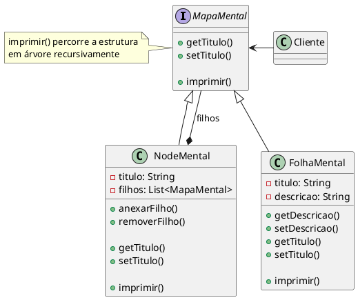

---
export_on_save:
  html: true
---

# Composite (Padrão de Projeto Estrutural)

### Mapa mental
Exemplo feito pelo time do Object Pool

## Motivação

Imagine o cenário de desenvolvimento de um app de anotações no formato de mapa mental, onde são criados mapas representados por nós (composições) que podem agrupar outros mapas dentro de si ou anotações simples (folhas). Tanto os mapas (nós) quanto as anotações (folhas) possuem um título que deve ser apresentado em tela, mas como representar objetos que compõem outros e objetos finais de maneira uniforme?

O padrão Composite resolve este problema fazendo com que composições e folhas sejam enxergadas através de uma única interface que representa as duas, dessa maneira, podem ser feitas operações recursivas em problemas que são estruturados em árvore, de uma forma em que ambas sejam tratadas uniformemente.

## Estrutura



## Participantes

- **MapaMental (Componente)** 
    - Declara a interface para os objetos na composição (Node e Folha);
    - Implementa comportamento-padrão para interface comum a todas as classes, conforme apropriado;
- **NodeMental (Composição)**
    - representa objetos-folha na composição. Uma folha não tem filhos;
    - define comportamento para objetos primitivos na composição.
- **FolhaMental (Folha)**
  - define comportamento para componentes que têm filhos;
  - armazena os componentes-filho;
  - implementa as operações relacionadas com os filhos presentes na interface de ```MapaMental```.
- **Cliente**
  - manipula objetos na composição através da interface de ```MapaMental```.

## Implementação

### MapaMental (Componente)
@import "./src/mapa_mental/MapaMental.java"

### NodeMental (Composição)
@import "./src/mapa_mental/NodeMental.java"

### FolhaMental (Folha)
@import "./src/mapa_mental/FolhaMental.java"

### Cliente
@import "./src/App.java"

## Aplicabilidade

Quando utilizar o padrão **Composite**:
> * Quando quiser representar hierarquias partes-todo de objetos;
> * Quando quiser que os clientes sejam capazes de ignorar a diferença entre composições
de objetos e objetos individuais. Os clientes tratarão todos os objetos na estrutura
composta de maneira uniforme.

## Colaborações

- Os clientes usam a interface ```MapaMental``` para interagir com os objetos na estrutura composta. Se o receptor é uma ```FolhaMental```, então a solicitação é tratada diretamente. Se o receptor é um ```NodeMental```, ele normalmente repassa as solicitações para os seus componentes-filhos, executando operações adicionais antes e/ou depois do repasse.
  
## Consequências

### Hierarquias compostas
Cria estruturas com objetos primitivos e compostos que podem se combinar recursivamente. O código do cliente pode tratar tanto objetos simples quanto compostos da mesma forma.

### Simplicidade para o cliente
O cliente pode lidar de forma uniforme com objetos individuais ou compostos, sem se preocupar se está tratando com uma folha ou um componente composto.

### Facilidade para adicionar novos componentes
Novos tipos de componentes (Composite ou Leaf) são automaticamente compatíveis com a estrutura existente e o código do cliente, sem a necessidade de modificações.

### Excesso de generalidade
A adição de novos componentes pode dificultar a imposição de restrições à composição, exigindo verificações e testes em tempo de execução para garantir conformidade.